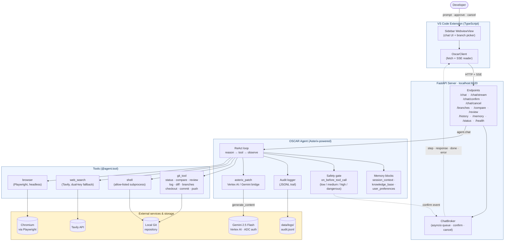
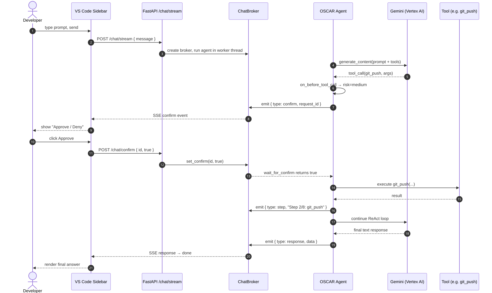
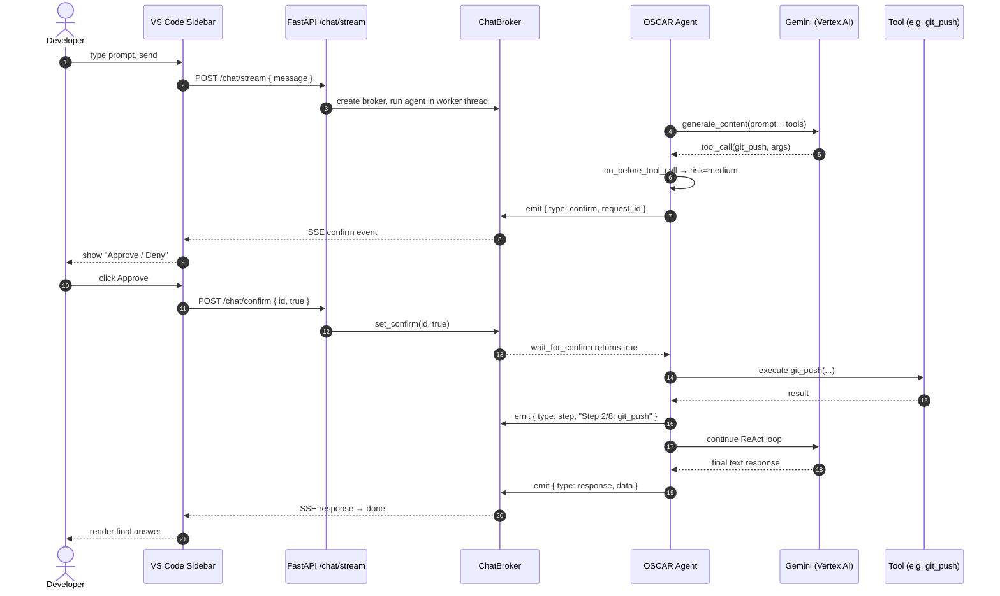

# OSCAR — System Architecture

> Current as of the repo state on the date this document was written. Rendered
> images live alongside this file: `oscar-architecture.png` / `.svg`, and
> `oscar-sequence.png` / `.svg`.

OSCAR is a GitHub-specialized AI coding assistant. It is delivered as a VS Code
extension and CLI, backed by a FastAPI server that wraps an Asterix-based agent
running on Gemini 2.5 Flash (Vertex AI).

---

## 1. System diagram





---

## 2. Layered text view (for slides / appendix)

```
┌───────────────────────────────────────────────────────────────────────────┐
│  Developer  ──▶  VS Code Sidebar (WebviewView, TypeScript)                │
│                  • chat UI   • branch picker   • approve / cancel buttons │
│                  └─ OscarClient  (fetch + SSE reader)                     │
└─────────────────────────────────┬─────────────────────────────────────────┘
                                  │  HTTP  +  Server-Sent Events
                                  ▼            (localhost:8420)
┌───────────────────────────────────────────────────────────────────────────┐
│  FastAPI Server  (oscar.api.server)                                       │
│  /chat   /chat/stream   /chat/confirm   /chat/cancel                      │
│  /branches   /compare   /review   /history   /memory   /status   /health  │
│  └─ ChatBroker  (asyncio queue · pending confirms · cancel flag)          │
└─────────────────────────────────┬─────────────────────────────────────────┘
                                  │  agent.chat(message)
                                  ▼
┌───────────────────────────────────────────────────────────────────────────┐
│  OSCAR Agent  (Asterix v0.2.1, patched)                                   │
│  ┌─ ReAct loop ─────────────────────────────────────────────────────────┐ │
│  │   reason → choose tool → execute → observe → repeat                  │ │
│  └──┬──────────────┬─────────────────┬─────────────────┬────────────────┘ │
│     │              │                 │                 │                  │
│  Memory blocks   asterix_patch   Safety gate       Audit logger           │
│  · session_ctx   (Vertex AI /    on_before_        JSONL trail            │
│  · knowledge_b    Gemini bridge)  tool_call        data/logs/audit.jsonl  │
│  · user_prefs                     low / med /                             │
│                                   high / dangerous                        │
└─────────────────────────────────┬─────────────────────────────────────────┘
                                  │  @agent.tool registry
                                  ▼
┌───────────────────────────────────────────────────────────────────────────┐
│  Tools                                                                    │
│  git_tool : status · compare · review · log · diff · branches             │
│             checkout · commit · push                                      │
│  shell    : run_shell_command  (allow-listed subprocess)                  │
│  web      : web_search  (Tavily, dual API-key fallback)                   │
│  browser  : navigate · search · extract · download  (Playwright)          │
└───────┬──────────────┬─────────────────┬────────────────┬─────────────────┘
        │              │                 │                │
        ▼              ▼                 ▼                ▼
  ┌──────────┐  ┌───────────────┐  ┌───────────┐  ┌──────────────┐
  │ Local    │  │ Gemini 2.5    │  │ Tavily    │  │ Chromium     │
  │ Git repo │  │ Flash (Vertex │  │ Search    │  │ (Playwright) │
  │          │  │ AI · ADC)     │  │ API       │  │              │
  └──────────┘  └───────────────┘  └───────────┘  └──────────────┘
```

---

## 3. Sequence — streaming chat with human-in-the-loop confirmation





---

## 4. Component legend

| Layer    | Component                              | Role                                                                    |
| -------- | -------------------------------------- | ----------------------------------------------------------------------- |
| Client   | VS Code extension (`vscode-oscar/`)    | Sidebar chat UI, branch picker, SSE consumer                            |
| API      | FastAPI server (`oscar.api.server`)    | Stateless HTTP/SSE bridge over the agent singleton                      |
| API      | `ChatBroker` (`oscar.api.runtime`)     | Thread-safe queue connecting agent worker thread to the asyncio loop    |
| Agent    | Asterix `Agent` (`oscar.core.agent`)   | ReAct loop, tool registry, memory blocks                                |
| Agent    | `asterix_patch`                        | Adds Gemini 2.5 Flash / Vertex AI support to Asterix v0.2.1             |
| Agent    | `safety.on_before_tool_call`           | Classifies each call as low / medium / high / dangerous; gates execution|
| Agent    | Audit logger                           | Append-only JSONL log of every tool call                                |
| Tools    | `git_tool`                             | 9 git operations (status, compare, review, log, diff, branches, …)      |
| Tools    | `shell`                                | Cross-platform subprocess runner with safe-command allow-list           |
| Tools    | `web_search`                           | Tavily with dual API-key fallback                                       |
| Tools    | `browser`                              | Playwright/Chromium for navigate, search, extract, download             |
| External | Gemini 2.5 Flash via Vertex AI         | Primary LLM (Application Default Credentials)                           |
| Storage  | `data/logs/audit.jsonl`                | Rotating audit trail of tool calls                                      |

---

## 5. Rebuilding the rendered images

The PNG and SVG images are produced from the `.mmd` sources via the Mermaid CLI:

```bash
npx --yes -p @mermaid-js/mermaid-cli mmdc \
    -i docs/oscar-architecture.mmd \
    -o docs/oscar-architecture.svg \
    -p docs/puppeteer-config.json \
    -b transparent

npx --yes -p @mermaid-js/mermaid-cli mmdc \
    -i docs/oscar-architecture.mmd \
    -o docs/oscar-architecture.png \
    -p docs/puppeteer-config.json \
    -b white -w 2000

# Repeat for oscar-sequence.mmd
```
